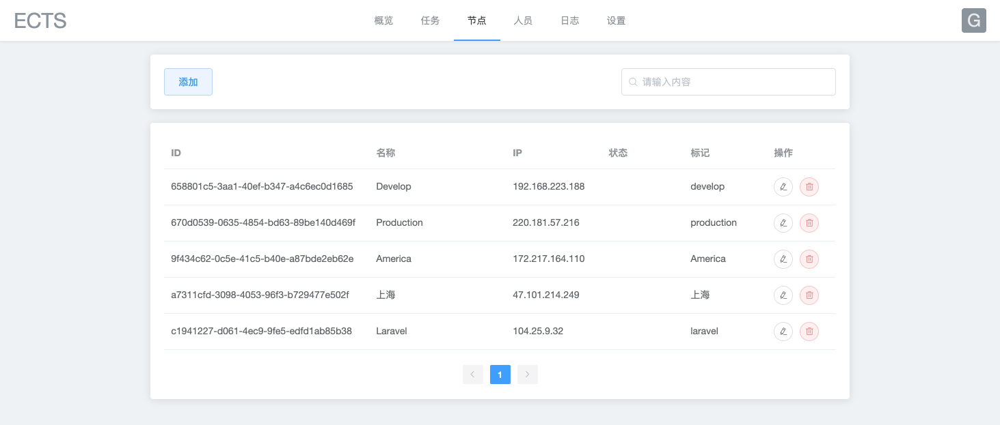
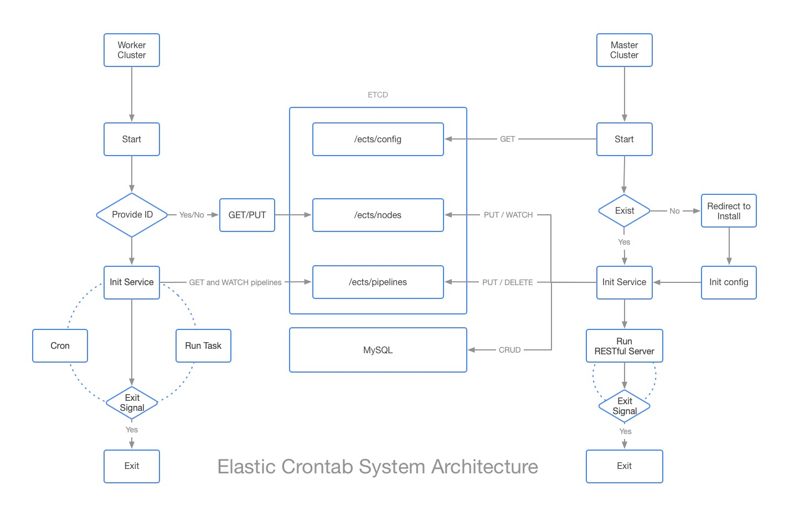

# ECTS

Elastic Crontab System


> Install view
---



> Worker View
---


> Setting View
---

## Architecture



### Master 
* RESTful API Server
* Scheduler Service
* Web UI
* HTTP task actuator

### Worker
* Shell task actuator

## Installation

```bash
go get github.com/betterde/ects

# install frontend dependencies
cd web && yarn install

# build frontend asset
yarn build

# install go-bindata
cd ../ && go get -u github.com/shuLhan/go-bindata/...

# package resource file
go-bindata -pkg web -o web/bindata.go web/dist/...

go build main.go -o ects

```

## LICENSE
ECTS is open-sourced software licensed under the MIT license.