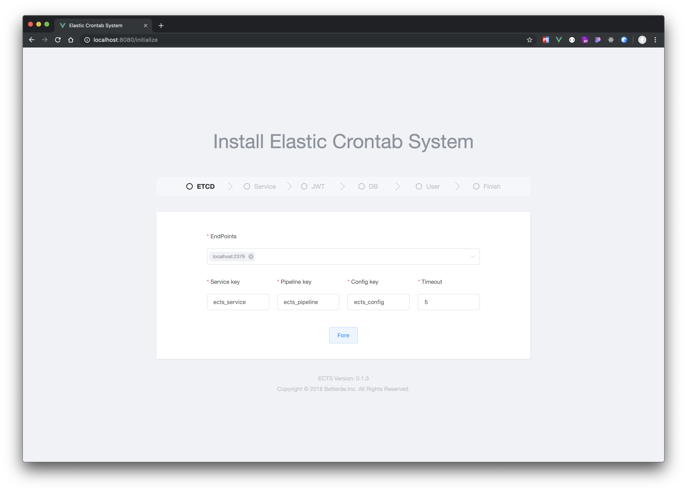
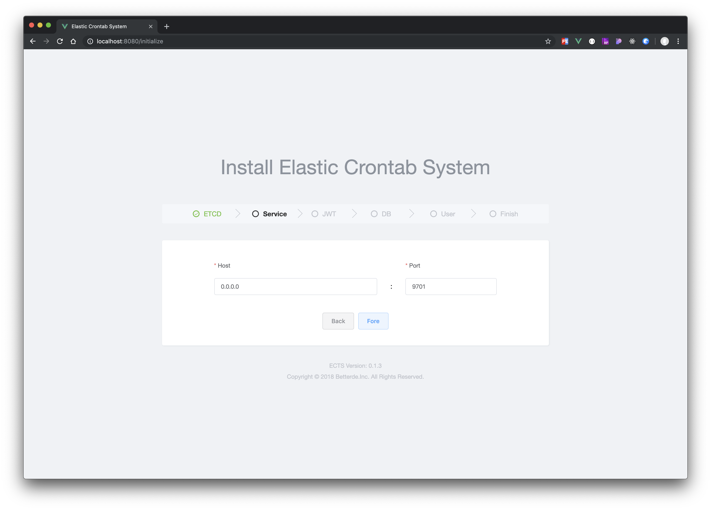
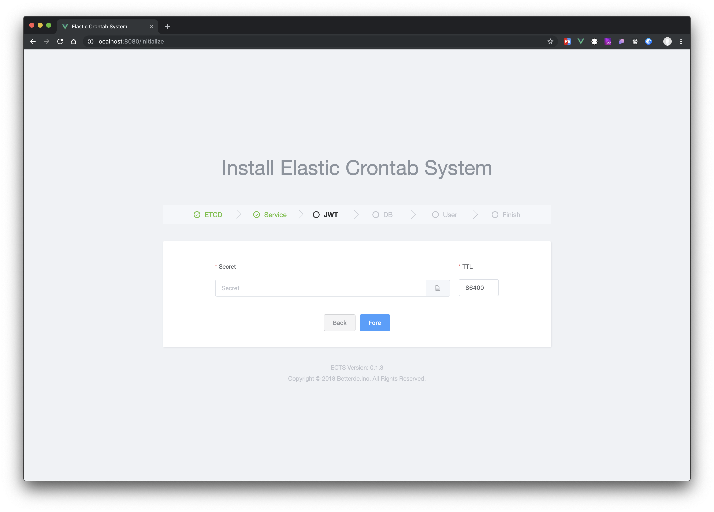
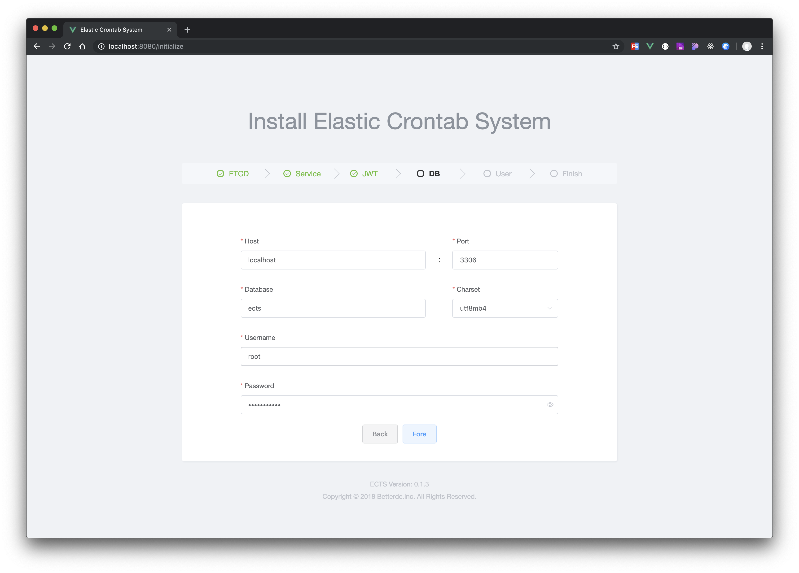
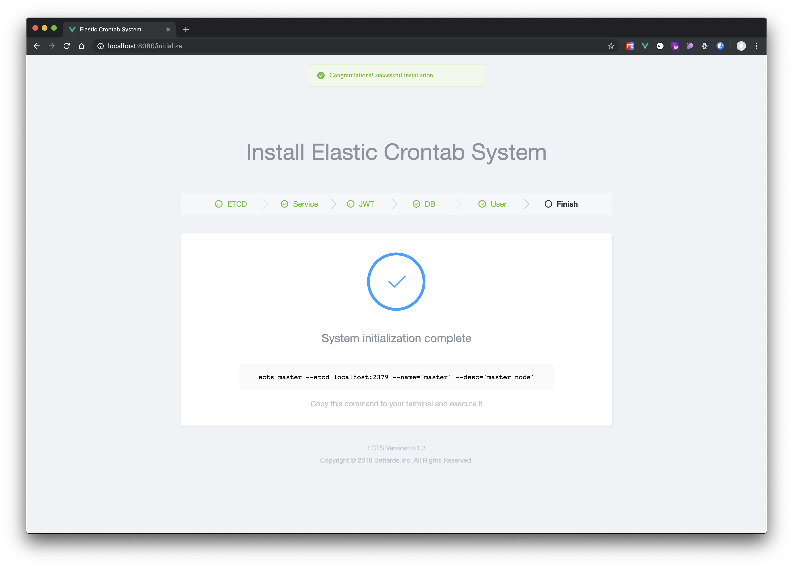

# ECTS

Elastic Crontab System

## Architecture


### Master 
* RESTful API Server
* Scheduler Service
* Web UI
* HTTP task actuator

### Worker
* Shell task actuator

## Installation

```bash
go get github.com/betterde/ects

# install frontend dependencies
cd web && yarn install

# build frontend asset
yarn build

# install go-bindata
cd ../ && go get -u github.com/shuLhan/go-bindata/...

# package resource file
go-bindata -pkg web -o web/bindata.go web/dist/...

go build main.go -o ects

```

## Initialization

### Run initialization service
```bash
$ ects init

Now listening on: http://localhost:9701
Application started. Press CMD+C to shut down.
```

### Open your browser

Point your browser to http://localhost:9701

### Config ETCD



### Cofnig Service



### Cofnig JWT



### Config DB



### Config User


### Complete



## LICENSE
ECTS is open-sourced software licensed under the MIT license.