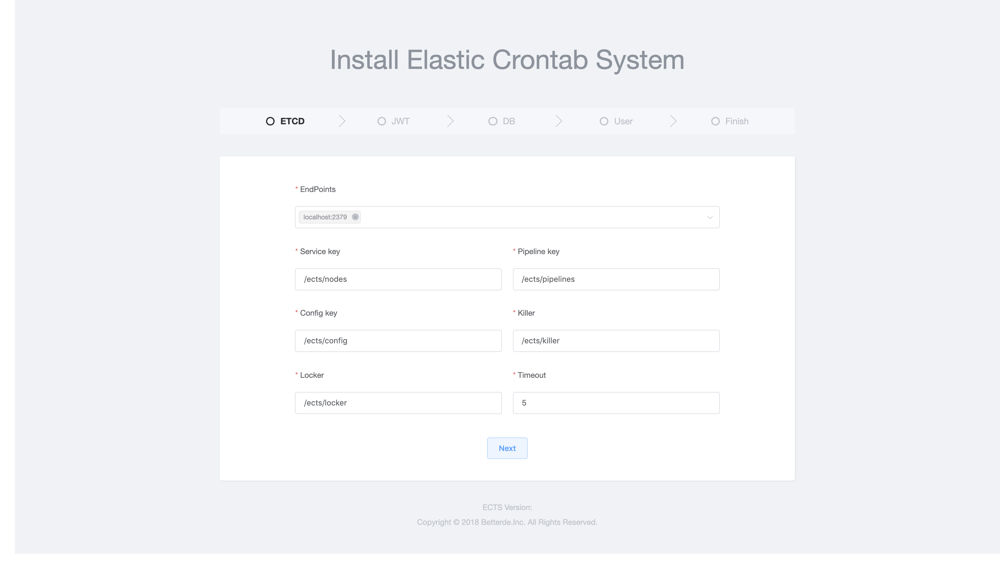
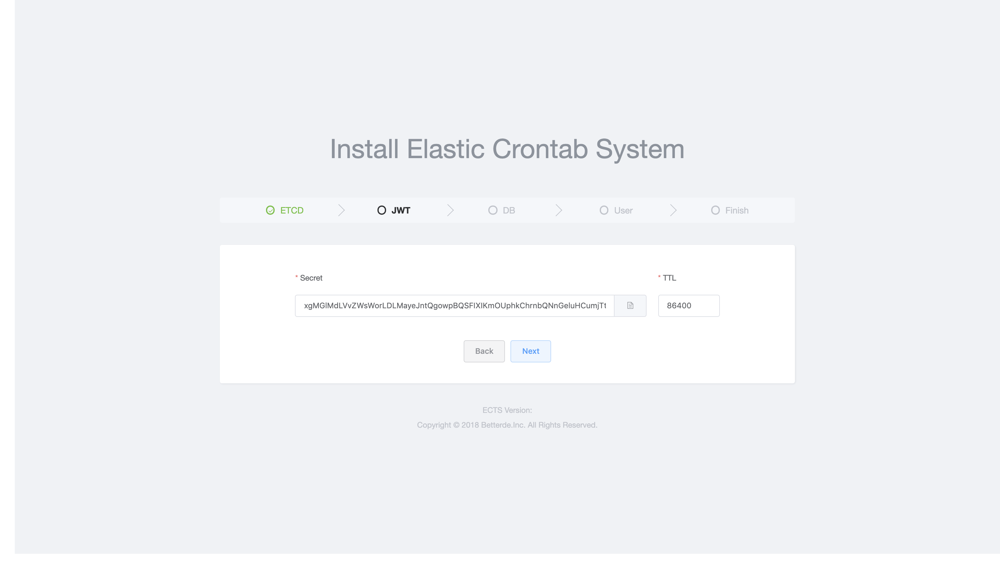
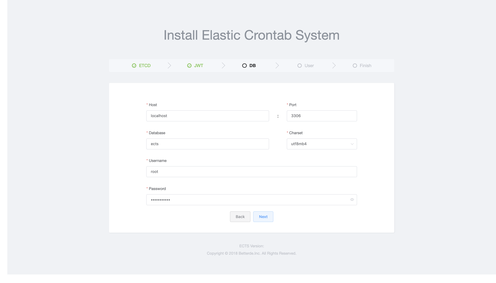
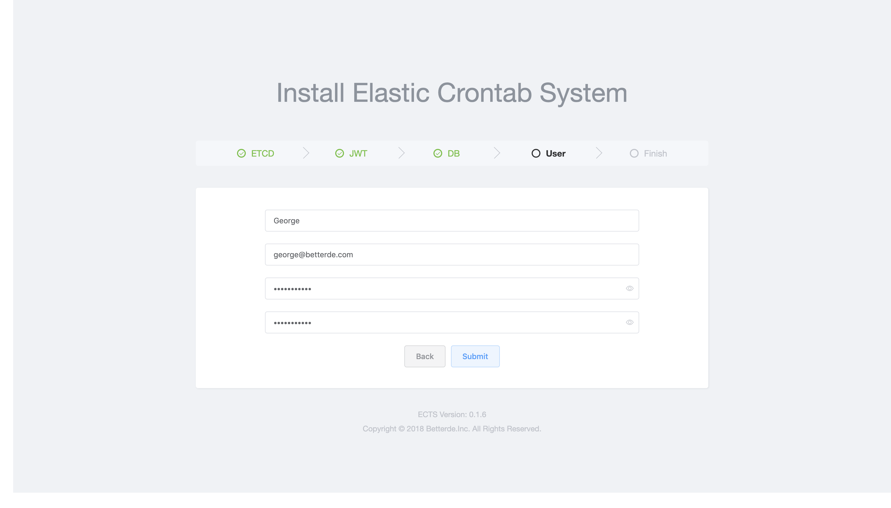
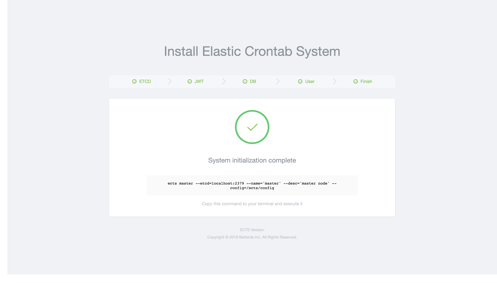
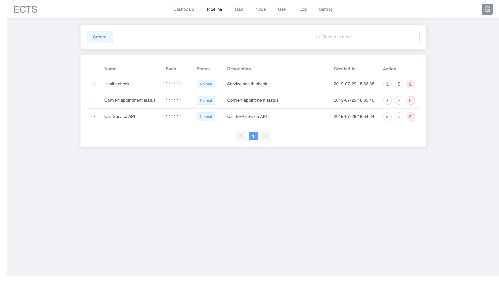
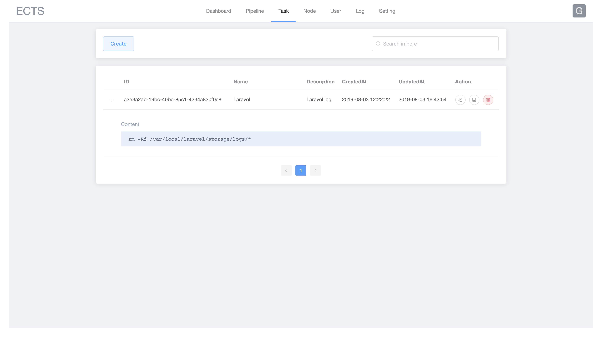
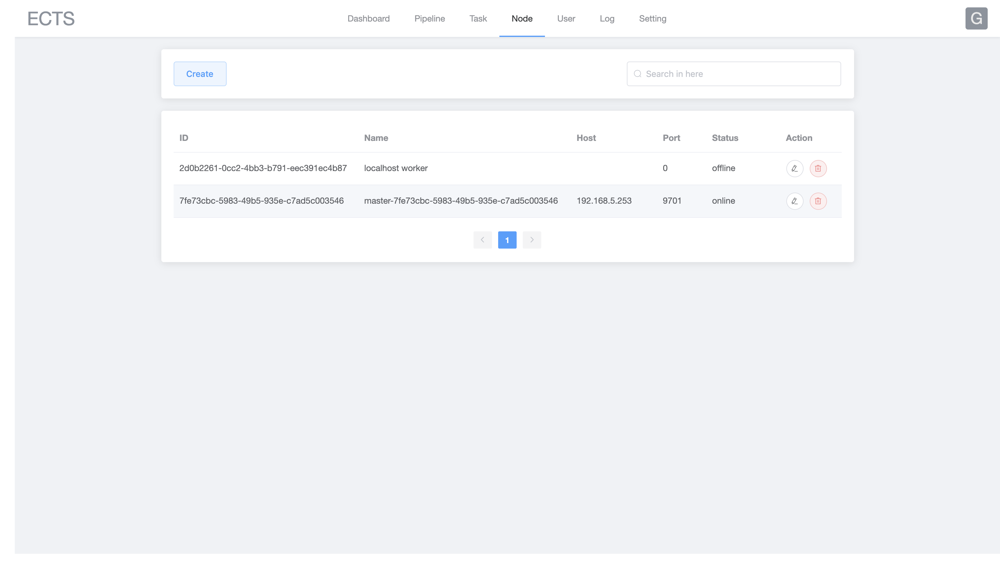
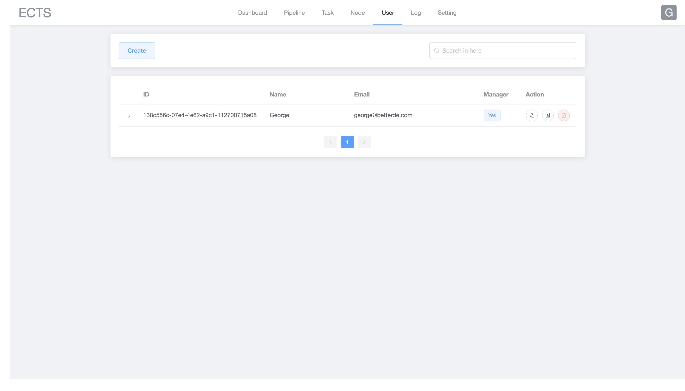
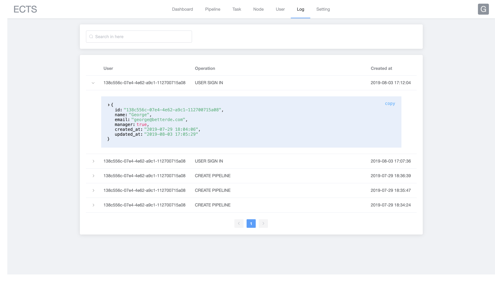

# Elastic Crontab System

[](https://github.com/betterde/ects/issues)
[](https://github.com/betterde/ects/network)
[](https://github.com/betterde/ects/stargazers)
[](https://github.com/betterde/ects/blob/master/LICENSE)

基于 ETCD 实现的分布式定时任务管理系统，让跨主机的定时任务管理变得更加简单高效。

## 架构设计


### Master 
* RESTful API
* 服务注册
* 服务发现
* Web UI

### Worker
* 调度器
* 执行器

## 安装

```bash
go get github.com/betterde/ects

# 安装前端依赖
cd web && yarn install

# build frontend asset
yarn build

# install go-bindata
cd ../ && go get -u github.com/shuLhan/go-bindata/...

# 打包静态资源
go-bindata -pkg web -o web/bindata.go web/dist/...

go build -o ects main.go

```

## 系统初始化

### 运行初始化服务
```bash
$ ects init -m web

Now listening on: http://localhost:9701
Application started. Press CMD+C to shut down.
```

#### 打开浏览器
打开你的浏览器并访问 http://localhost:9701

#### 配置 ETCD



#### 配置 JWT



#### 配置 DB



#### 配置 User



#### 完成配置



### 从配置文件初始化

支持 JSON、YAML 格式：

```bash
ects init -m json -p CONFIG_FILE_PATH -n ADMIN_NAME -P ADMIN_PASS -e ADMIN_MAIL
ects init -m yaml -p CONFIG_FILE_PATH -n ADMIN_NAME -P ADMIN_PASS -e ADMIN_MAIL
```

## Web UI

### 流水线



### 任务



### 节点



### 用户



### 日志



## TODO

- [x] Web UI；
- [x] Master 节点 API；
- [x] 基于 ETCD 的服务注册于发现；
- [x] 基于 ETCD 的流水线发布于订阅；
- [x] 基于 ETCD 实现的分布式锁，用于更新 Worker 节点的状态；
- [] 实现单节点部署模式，即不依赖 ETCD 实现分布式，在一个节点上融合 Master 和 Worker 的所有功能；
- [] 实现 HTTP 任务执行器，类似 Postman；
- [] 实现 Mail 任务执行器；
- [] 实现 Hook 任务执行器；
- [] 角色权限管理模块；
- [] 集成单元测试；
- [] 集成 Docker 部署；
- [] 集成 CI；
- [] 热重启；
- [] 软件更新；
- [] 项目文档。

## LICENSE
ECTS is open-sourced software licensed under the MIT license.