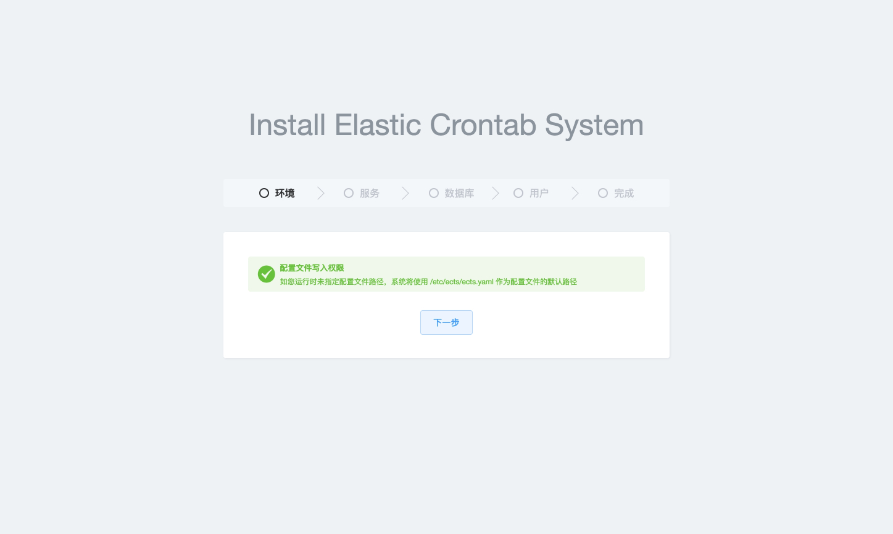
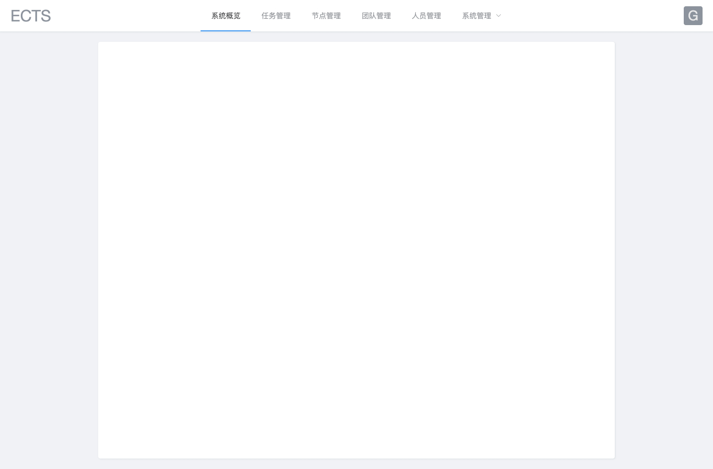

# ECTS

Elastic Crontab System



> Install view
---



> Dashboard View
---


## Architecture

### Master 

### Worker

## Installation

```bash
go get github.com/betterde/ects

# install frontend dependencies
cd web && yarn install

# build frontend asset
yarn build

# install go-bindata
cd ../ && go get -u github.com/shuLhan/go-bindata/...

# package resource file
go-bindata -pkg web -o web/bindata.go web/dist/...

go build main.go -o ects

```

## LICENSE
ects is open-sourced software licensed under the MIT license